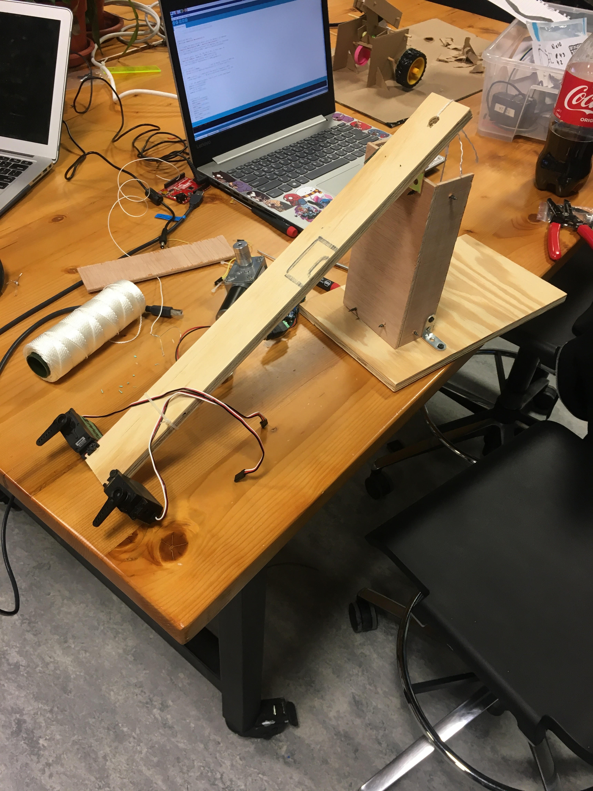
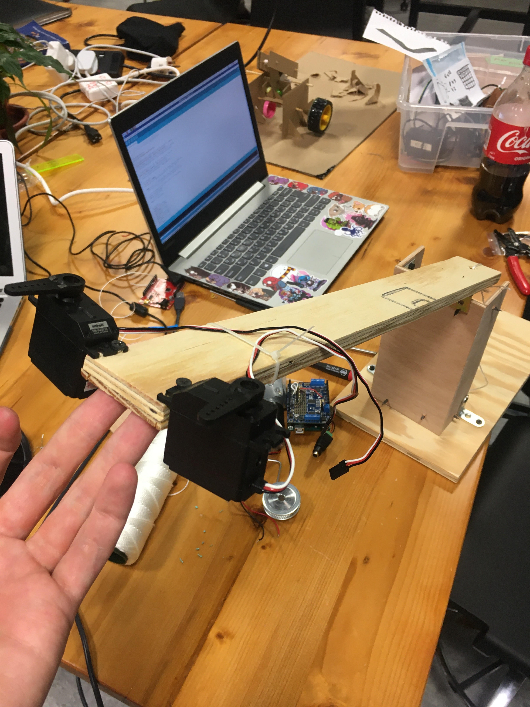

# PerformingRobots

## Presentation
My presentation was focused on the "feelings" of the robot. 
In the movie the main hero tells the robot: 
>-"You don't feel fear, you don't have dreams, even a dog has dreams. Can you write a symphone? Can you take a canvas a make a masterpiece of it?" 

On what the robot asks back: 
>-"Can you?"

Video available at [this](https://www.youtube.com/watch?v=siHfHUm3HGE) link

## Final project idea
I would like to re-create a theater piece using a robot that will be one of the actors. 
The robot will have an audio device that has programmed phrases which need to be told at a specific moment 

## Final Project Documentation #1

# Praggya and I met up to divide the work. She had interest in the the robot that is going to be assembled by the other bot. Then I've taken the "robotic arm" task to do. I had a cardboard version before I started on the wooden one. 

